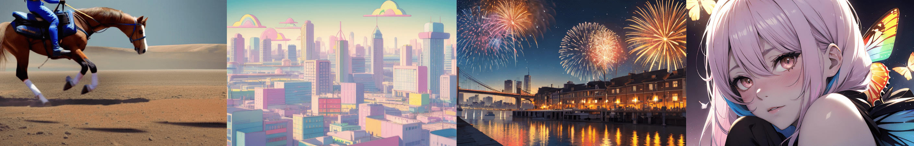

# Stable Diffusion CLI on Modal

[Modal](https://modal.com/)上でStable Diffusionを動かすためのDiffusersベースのスクリプトです。WebUIは無く、CLIでのみ動作します。txt2imgの推論を実行することができ、img2imgとUpscalerを利用した高解像度化の機能を備えています。

## このスクリプトでできること

1. txt2imgまたはimt2imgによる画像生成ができます。
  
  利用可能なバージョン:
    - SDXL
    - 1.5(コードをリライト中のため一時的に利用できない状態です)

2. アップスケーラーとControlNet Tileを利用した高解像度な画像を生成することができます。

| ベース画像                                                       | アップスケール後                                                 |
| ---------------------------------------------------------------- | ---------------------------------------------------------------- |
|  |  |

3. その他、LoRAとTextual inversionを利用できます。

## 必須項目

このスクリプトを実行するには最低限下記のツールが必要です:

- python: >= 3.11
- modal: >= 1.0.3
- ModalのAPIトークン
- Hagging FaceのAPIトークン（非公開のリポジトリのモデルを参照したい場合に必須）

`modal`はModalをCLIから操作するためのPythonライブラリです。下記のようにインストールします:

```bash
pip install modal
```

And you need a modal token to use this script:

```bash
modal token new
```

詳細は[Modalのドキュメント](https://modal.com/docs/guide)を参照してください。

## クイックスタート

下記の手順で画像が生成され、outputs ディレクトリに出力されます。

1. リポジトリをgit clone
2. ./app/config.example.yml を ./app/config.ymlにコピー
3. Makefile を開いてプロンプトを設定
4. make appをコマンドラインで実行(Modal上にアプリケーションが構築されます)
5. make img_by_sd15_txt2img(スクリプトが起動します)

## ディレクトリ構成

```txt
.
├── .env                        # Secrets manager
├── Makefile
├── README.md
├── cmd/                      # A directory with scripts to run inference.
│   ├── outputs/                # Images are outputted this directory.
...
│   └── txt2img_handler.py         # A script to run txt2img inference.
└── app/                # A directory with config files.
    ├── __main__.py             # A main script to run inference.
    ├── Dockerfile              # To build a base image.
    ├── config.yml              # To set a model, vae and some tools.
    ├── requirements.txt
    ├── setup.py                # Build an application to deploy on Modal.
    ├── stable_diffusion_1_5.py # There is a class to run inference about sd15.
    └── stable_diffusion_xl.py  # There is a class to run inference about sdxl.
```

## 使い方の詳細

### 1. リポジトリをgit cloneする

```bash
git clone https://github.com/hodanov/stable-diffusion-modal.git
cd stable-diffusion-modal
```

### 2. .envファイルを設定する

Hugging FaceのトークンをHUGGING_FACE_TOKENに記入します。

このスクリプトはHuggingFaceからモデルをダウンロードして使用しますが、プライベートリポジトリにあるモデルを参照する場合、この環境変数の設定が必要です。

```txt
HUGGING_FACE_TOKEN="ここにHuggingFaceのトークンを記載する"
```

### 3. ./app/config.ymlを設定する

推論に使うモデルを設定します。Safetensorsファイルをそのまま利用します。VAE、LoRA、Textual Inversionも設定可能です。

下記のように、nameにモデル名、urlにSafetensorsファイルがあるURLを指定します。

```yml
# 設定例
version: "sd15" # Specify 'sd15' or 'sdxl'.
model:
  name: stable-diffusion-1-5
  url: https://huggingface.co/runwayml/stable-diffusion-v1-5/blob/main/v1-5-pruned.safetensors # Specify URL for the safetensor file.
vae:
  name: sd-vae-ft-mse
  url: https://huggingface.co/stabilityai/sd-vae-ft-mse-original/blob/main/vae-ft-mse-840000-ema-pruned.safetensors
controlnets:
  - name: control_v11f1e_sd15_tile
    repo_id: lllyasviel/control_v11f1e_sd15_tile
```

LoRAは下記のように指定します。

```yml
# 設定例
loras:
  - name: mecha.safetensors # ファイル名を指定。任意の名前で良いが、拡張子`.safetensors`は必須。
    url: https://civitai.com/api/download/models/150907?type=Model&format=SafeTensor # ダウンロードリンクを指定
```

SDXLを使いたい場合は`version`に`sdxl`を指定し、urlに使いたいsdxlのモデルを指定します。

```yml
version: "sdxl"
model:
  name: stable-diffusion-xl
  url: https://huggingface.co/xxxx/xxxx
```

### 4. Makefileの設定（プロンプトの設定）

プロンプトをMakefileに設定します。

```makefile
# 設定例
img_by_sdxl_txt2img:
  cd ./cmd && modal run txt2img_handler.py::main \
  --version "sdxl" \
  --prompt "A dog is running on the grass" \
  --n-prompt "" \
  --height 1024 \
  --width 1024 \
  --samples 1 \
  --steps 30 \
  --use-upscaler "True" \
  --output-format "avif"
```

- prompt: プロンプトを指定します。
- n-prompt: ネガティブプロンプトを指定します。
- height: 画像の高さを指定します。
- width: 画像の幅を指定します。
- samples: 生成する画像の数を指定します。
- steps: ステップ数を指定します。
- seed: seedを指定します。
- use-upscaler: 画像の解像度を上げるためのアップスケーラーを有効にします。
- fix-by-controlnet-tile: ControlNet 1.1 Tileの利用有無を指定します。有効にすると、崩れた画像を修復しつつ、高解像度な画像を生成します。sd15のみ対応。
- output-format: 出力フォーマットを指定します。avifとpngのみ対応。

### 5. アプリケーションをデプロイする

下記のコマンドでModal上にアプリケーションが構築されます。

```bash
make app
```

### 6. 推論を実行する

下記のコマンドでtxt2img推論が実行されます。

```bash
make img_by_sd15_txt2img

or

make img_by_sdxl_txt2img
```
